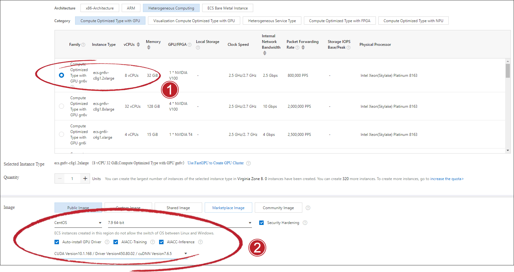
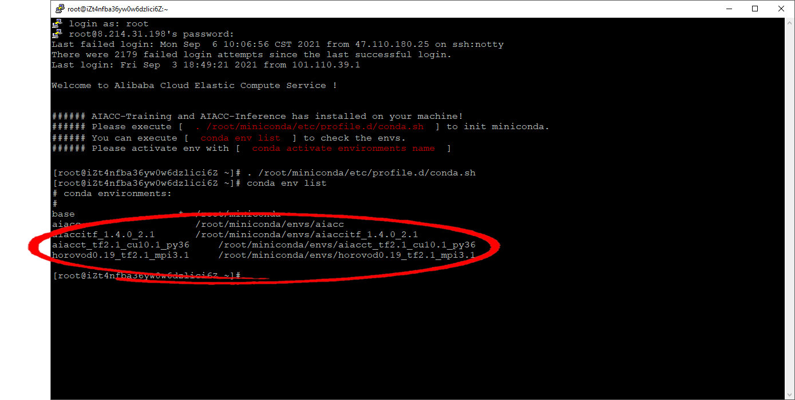
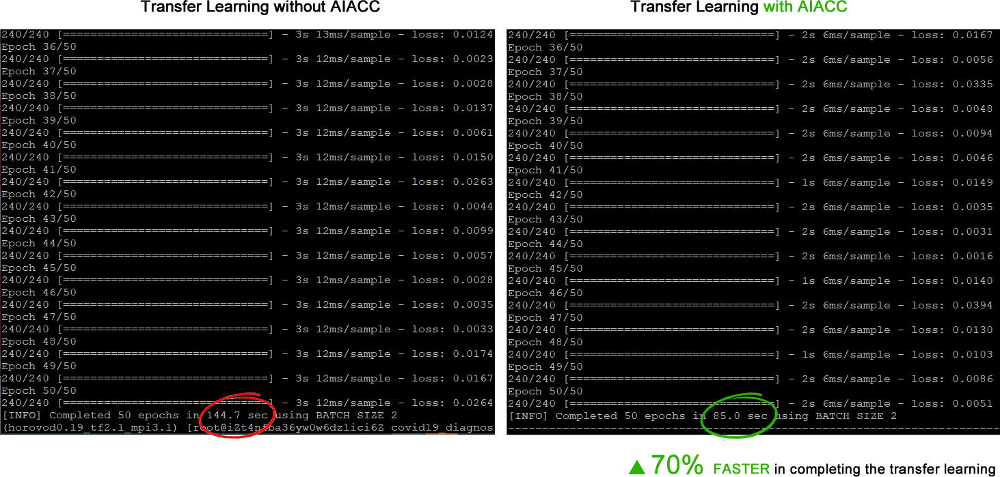

# AIACC GPU Demo

|    |    |
| ---- | ---- |
|  Author  |  Jixin Jia (Gin)   |
|  Date  |  2021/09/01   |
|  Version  |  1.0   |
|  Purpose  |  Demonstrate accelerated training and inference by using AIACC on Alibaba Cloud NVIDIA GPU  |

 

## 1. Set up AIACC
Tick AIACC install options during ECS provisioning

Activate the auto-installed demo AIACC conda env:

 

## 2. Train Model
Execute `**_horovod.py` for Horovod distributed training  
Execute `**_perseus.py` for AIACC boosted distributed training

Compare and contrast the training efficiency 

Example: 

**[Note]** 
Make sure to run the test scripts in their corresponding conda environment

 

## 3. Verified Environment
The performance test is conducted on following environments

|  GPU Hardware  |    |
| ---- | ---- |
|  GPU  |  Nvidia V100 x 4 |
|  Driver  |  450.x.x  |
|  CUDA  |  10.1.x  |
|  CuDNN  |  7.6.5  |

 

| Dependencies   |    |
| ---- | ---- |
|  Tensorflow GPU |  2.1  |
|  Open MPI |  3.1.3  |
|  NCCL |  2.5.6  |
|  OpenCV |  4.5.1  |

